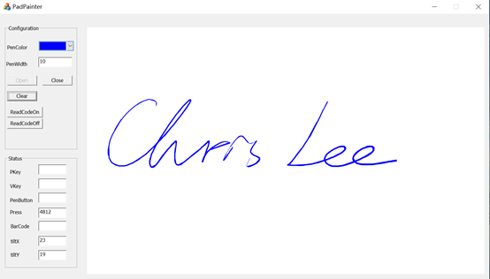

# ugee-signature-for-windows
## Development Environment：
The demo is provided in C++ and C#. The operating environment is Windows 7 or later. The software development tool is Visual Studio 2015 or later.

Before running this example, you need to connect to the UGEE signature tablet/pad. This API supports all models of UGEE signature tablets/pads, please ensure that the relevant drivers are installed. The display driver needs to be installed for signature pads, which can be found at this link: https://business.hanvonugee.com/en/driver
## Verify the Connection of the UGEE Signature Tablet/Pad and Prepare for Running the Example：
* Connect to the UGEE signature tablet/pad.
* Open the ./app directory and run PadPainter.exe or ScreenSignature.exe  (depending on your device is a signature tablet or pad).
* Draw a line on the signature tablet/pad. If the application displays the handwriting, it means that the tablet/pad has been recognized normally and has entered the working status. For detailed operations, please refer to README.md
## Run the Demo Program：
* Take the signature tablet as an example, open the sharpScreenSignature.sln project file, and make sure that your computer has installed Visual Studio 2015 or above.
* The demo example can be run directly, and the solution platform defaults to X86. If you need X64, please reference X64-libsign.dll
* Application: After setting the handwriting color and note width, please click <Open> to open the device for signing.
### Status：
* Pkey: physical key value
* Vkey: virtual key value
* PenButton: pen express key value
* Press: pressure sensitivity
* PBarCode: barcode value
* tiltX: pen tilt X
* tiltY: pen tilt Y
Some of the above attribute can only be supported and sent feedback values on specific signature models. Please see an example as below:
 
# Support:：
If you encounter any technical issues, please refer to the FAQ on our website under [https://business.hanvonugee.com/en/faq](https://business.hanvonugee.com/en/faq). 
