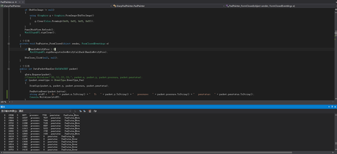

# ugee-signature-for-windows
## Introduction：
The Ugee Signature SDK provides the most original handwriting data, including but not limited to pen X, Y, pressure, pen status, pen tilt angle and other related original values. Developers can directly obtain the original values, reducing the risk of handwritten signatures being tampered with. However, we also provide a relatively simple demonstration program to allow developers to quickly understand and use our products.
## Demo Program：
We have made two different demonstration programs for the pen tablet and pen display. The following steps describe the operation method：
### Signature Tablet：
* Connect the device to the host computer
* Open a demo or code example
* First click the open device button, then you can write freely
### Signature Display：
* Connect the device to the host computer
* After the screen displays normally, switch to extended display
* Open a demo or code example
* Click the Sign button to start signing
* Ps:In the demo program, the 10.1-inch screen must be set to expand before it can be used
## Development Environment：
Support Windows 7 and above versions to demonstrate the use of SDK
Sample code language：
* C++
* C#
## Sample Code：
You only need to reference libsign.dll to call the interface function. The best development tool is Visual Studio 2015 and above. If you use C# development, it is recommended to install .NET Framework 4.0 and above
 
## support：
If you encounter problems with the technical components, please refer to the [FAQ](https://business.hanvonugee.com/en/faq/3)
For further support, please contact us via email: signature.software@ugee.com